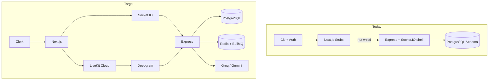
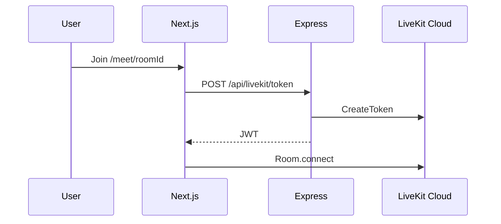
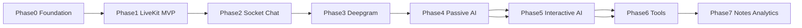

# Meeting AI — Full Phased Implementation Plan

## Current state (baseline)

| Layer | Done | Gap |
|-------|------|-----|
| Auth | Clerk sign-in/up, minimal dashboard | No client call to [`server/src/routes/user.routes.ts`](server/src/routes/user.routes.ts); `/meet` not protected ([`client/src/middleware.ts`](client/src/middleware.ts) guards `/meeting` only) |
| DB | Schema for all 6 models in [`server/prisma/schema.prisma`](server/prisma/schema.prisma) | No migrations; Prisma client output path configured but not generated in repo |
| API | Create/list meetings, user sync | No `GET /meetings/:roomId`, host-scoped list, end meeting, participant/message APIs; **no auth** |
| Realtime | Socket.IO bootstrap in [`server/src/server.ts`](server/src/server.ts) | Only `connection`/`disconnect`; no vision events |
| Frontend | File tree for dashboard + meeting UI | **All** meeting/dashboard components are empty 0-byte stubs |
| Video | `@daily-co/daily-js` in [`client/package.json`](client/package.json) | Unused; spec requires **LiveKit** |
| AI / queues | `bullmq`, `ioredis`, `@anthropic-ai/sdk` in server deps | Zero implementation; no Groq/Gemini/Deepgram/ElevenLabs packages |



---

## Phase 0 — Foundation and conventions (1–2 days)

**Goal:** Stable dev environment, aligned routes, secure API boundary.

1. **Database ops**
   - Run `prisma migrate dev` against Supabase `DATABASE_URL`
   - Generate client to `server/src/generated/prisma` (per schema `output`)
   - Add root `server/.env.example` with: `DATABASE_URL`, `REDIS_URL`, `CLERK_SECRET_KEY`, `LIVEKIT_*`, `DEEPGRAM_API_KEY`, `GROQ_API_KEY`, `GOOGLE_AI_API_KEY`, `ELEVENLABS_API_KEY`

2. **Route and auth alignment**
   - Standardize meeting URL to **`/meet/[roomId]`** (matches existing folder) OR rename folder to `/meeting/[roomId]` — pick one; update [`client/src/middleware.ts`](client/src/middleware.ts) to protect `/meet(.*)` (and `/notes`, `/settings` when added)
   - Add Clerk JWT verification middleware on Express (`@clerk/express` or manual JWKS verify) for all `/api/*` except health
   - Map `auth().userId` (Clerk) → Prisma `User.id` via `clerkUserId` on every mutating request

3. **Client user sync**
   - After sign-in: `POST /api/users/sync` with Clerk session data
   - Store Prisma `user.id` in React context or Zustand for `hostId` when creating meetings

4. **Schema hardening (small migration)**
   - Add optional `User` relations on `Participant.userId` and `Message.senderId` (or rename to `userId` FK) for integrity and analytics later

5. **Monorepo DX**
   - Document `npm run dev` for client (`:3000`) + server (`:5000`)
   - Add `NEXT_PUBLIC_API_URL` and `NEXT_PUBLIC_SOCKET_URL` to client env

---

## Phase 1 — MVP: Dashboard + meetings + LiveKit (3–5 days)

**Goal:** User can create a meeting, open `/meet/[roomId]`, see/hear participants, leave.

### Backend

| Endpoint | Purpose |
|----------|---------|
| `POST /api/meetings` | Create (auth; `hostId` from synced user) |
| `GET /api/meetings` | List meetings for current user (host or participant) |
| `GET /api/meetings/room/:roomId` | Resolve meeting + metadata |
| `PATCH /api/meetings/:id/end` | Set `endedAt` |
| `POST /api/livekit/token` | Issue LiveKit access token (`roomName` = `roomId`, identity = Clerk user) |

Extend [`server/src/routes/meeting.routes.ts`](server/src/routes/meeting.routes.ts); add `livekit.routes.ts` using `livekit-server-sdk`.

### Frontend

- **Remove** `@daily-co/daily-js`; **add** `livekit-client` + `@livekit/components-react` (optional, speeds UI)
- Implement stubs:
  - [`client/src/components/dashboard/CreateMeetingDialog.tsx`](client/src/components/dashboard/CreateMeetingDialog.tsx) — form → create API → navigate to `/meet/{roomId}`
  - [`client/src/components/dashboard/RecentMeetings.tsx`](client/src/components/dashboard/RecentMeetings.tsx) + [`MeetingCard.tsx`](client/src/components/dashboard/MeetingCard.tsx)
  - [`client/src/app/meet/[roomId]/MeetingClient.tsx`](client/src/app/meet/[roomId]/MeetingClient.tsx) — connect room, layout shell
  - [`VideoGrid.tsx`](client/src/components/meeting/VideoGrid.tsx), [`ParticipantTile.tsx`](client/src/components/meeting/ParticipantTile.tsx), [`MeetingControls.tsx`](client/src/components/meeting/MeetingControls.tsx) — mute/camera/screen share/leave
- Wire React Query for meeting list/create
- Replace default [`client/src/app/page.tsx`](client/src/app/page.tsx) with marketing redirect or link to dashboard

### LiveKit integration pattern



---

## Phase 2 — Realtime chat and presence (3–4 days)

**Goal:** Persistent meeting chat, typing, participant join/leave synced via Socket.IO.

### Socket.IO server module

Refactor [`server/src/server.ts`](server/src/server.ts) → `socket/handlers.ts` with authenticated handshake (Clerk token in `auth` payload).

| Event | Direction | Behavior |
|-------|-----------|----------|
| `join_meeting` | client→server | Join `room:{roomId}`; upsert `Participant`; emit presence |
| `leave_meeting` | client→server | Set `leftAt`; broadcast |
| `send_message` | client→server | Persist `Message`; broadcast to room |
| `typing_start` / `typing_stop` | bidirectional | Ephemeral (Redis optional) |
| `message_history` | server→client | Last N messages on join |

### Client

- [`ChatPanel.tsx`](client/src/components/meeting/ChatPanel.tsx) + `lib/socket.ts` singleton
- Support `MessageRole`: USER, AI, SYSTEM in UI styling
- Optional: Redis adapter for Socket.IO horizontal scale (defer if single instance is fine for dev)

### API supplements

- `GET /api/meetings/:roomId/messages?cursor=` for HTTP fallback / search indexing later

---

## Phase 3 — Live transcription (4–6 days)

**Goal:** Speech → Deepgram → `transcript_chunk` → DB `Transcript` rows.

### Audio path (LiveKit → Deepgram)

- **Server-side agent** (recommended): LiveKit Egress or **LiveKit Agents** pipeline subscribing to room audio, forwarding to Deepgram Nova-2 streaming API
- Alternative for MVP: client forwards audio via data channel (worse for quality; use only if agent setup is blocked)

### Events and storage

| Event | Behavior |
|-------|----------|
| `transcript_chunk` | Broadcast interim/final text; on `is_final`, `prisma.transcript.create` |
| `transcript_history` | Send recent chunks on `join_meeting` |

### UI

- Transcript sidebar in meeting room (collapsible); speaker labels from Deepgram diarization or LiveKit participant identity

### Dependencies

- Add `@deepgram/sdk` on server
- Env: `DEEPGRAM_API_KEY`

---

## Phase 4 — Passive AI (notes, summaries, action items) (5–7 days)

**Goal:** AI listens without @mentions; live notes update in [`NotesPanel.tsx`](client/src/components/meeting/NotesPanel.tsx).

### Job architecture (BullMQ + Redis)

```
transcript_chunk (final)
    → queue: process-transcript
    → Llama 3.1 8B (Groq): intent / mention filter / chunk relevance
    → queue: update-notes (debounced per meeting)
    → Gemini 2.5 Flash: structured JSON (summary, actionItems, decisions, deadlines)
    → prisma.note.upsert + socket emit note_updated
```

### Socket

| Event | Behavior |
|-------|----------|
| `note_updated` | Push full or patch `Note.content` Json to clients |

### Models (per your spec)

- **Gemini 2.5 Flash** — structured extraction (summaries, action items, decisions)
- **Llama 3.1 8B (Groq)** — cheap classification between passive update vs defer to interactive handler

### Server layout

```
server/src/
  ai/
    groq.ts
    gemini.ts
    prompts/passive-notes.ts
  queues/
    transcript.worker.ts
    notes.worker.ts
  services/
    notes.service.ts
```

Install: `groq-sdk`, `@google/generative-ai` (or official Gemini SDK).

---

## Phase 5 — Interactive AI (@AI) (4–5 days)

**Goal:** Users type `@AI summarize this`; streamed reply in [`AIAssistantPanel.tsx`](client/src/components/meeting/AIAssistantPanel.tsx).

### Flow

1. `send_message` detects `@AI` (8B classifier backup)
2. Load meeting context: recent transcripts + notes + messages
3. **Groq Llama 3.3 70B** — chat completion with streaming
4. Emit `ai_token` chunks; finalize as `Message` with `role: AI`
5. Optional: **ElevenLabs** TTS → play in room or local-only toggle

| Event | Behavior |
|-------|----------|
| `ai_token` | Stream tokens to initiating client (and optionally room) |
| `ai_tool_called` | Emit when tool invoked (Phase 6) |

### Modes

- **Passive:** Phase 4 workers only
- **Interactive:** Phase 5 handler on mention; do not double-respond (8B router)

---

## Phase 6 — Tool calling and integrations (5+ days)

**Goal:** AI can execute server-side tools and return results into chat.

### Tool registry (Express)

Planned tools from spec: `search_web`, `create_calendar_event`, `create_task`, `get_document`, `send_summary`, `set_reminder`.

```
Groq tool_call
  → validate + ai_tool_called event
  → execute in server/services/tools/
  → append tool result to LLM thread
  → stream final ai_token response
```

- Start with **2 tools** (e.g. `send_summary` email stub + `search_web` via Tavily/SerpAPI) before calendar integrations
- Store tool audit log (new `ToolInvocation` model optional) or embed in `Message` metadata Json

### Security

- Host-only tools for destructive actions
- Rate limits per meeting/user via Redis

---

## Phase 7 — Post-meeting UX, search, analytics (4–6 days)

**Goal:** Complete page map from spec.

| Route | Features |
|-------|----------|
| [`/notes/[meetingId]`](client/src/app/notes/[meetingId]/page.tsx) | Read-only notes, summary, action items, export |
| [`/settings`](client/src/app/settings/page.tsx) | Profile, AI voice toggle, notification prefs |
| Dashboard enhancements | Search transcripts (Postgres `ILIKE` or pgvector later), meeting analytics |

### Analytics (server aggregates)

- Talk time per participant (from transcript timestamps + Participant)
- Message counts, AI invocation counts
- Topic distribution (Gemini batch job on meeting end via `meeting.endedAt` trigger)

### Meeting end pipeline

- On leave / host ends: BullMQ job `finalize-meeting` → final summary → persist → optional `send_summary` tool

---

## Cross-cutting concerns (apply throughout)

| Concern | Approach |
|---------|----------|
| **Auth** | Clerk on Next + verified JWT on Express; never trust raw `hostId` in body |
| **Error handling** | Zod validate API bodies; consistent `{ error, code }` JSON |
| **UI** | Expand shadcn (`dialog`, `input`, `card`, `scroll-area`, `tabs`) for dashboard and panels |
| **Testing** | Smoke: create meeting → join LiveKit → send chat → receive transcript mock → note update |
| **Cleanup** | Remove unused `next-auth` from client if Clerk-only |

---

## Suggested implementation order (dependency graph)



---

## Key files to touch first (Phase 0–1)

- [`client/src/middleware.ts`](client/src/middleware.ts) — protect `/meet`, `/notes`, `/settings`
- [`client/package.json`](client/package.json) — swap Daily → LiveKit packages
- [`server/src/server.ts`](server/src/server.ts) — auth middleware, route registration
- [`server/src/routes/meeting.routes.ts`](server/src/routes/meeting.routes.ts) — scoped queries + room lookup
- Empty stubs under [`client/src/components/meeting/`](client/src/components/meeting/) and [`client/src/components/dashboard/`](client/src/components/dashboard/)

---

## Risks and decisions

| Risk | Mitigation |
|------|------------|
| LiveKit audio → Deepgram wiring is non-trivial | Use LiveKit Agents docs early; spike in Phase 1 before Phase 3 commitment |
| Prisma 7 + adapter-pg | Verify `prisma generate` and runtime connection in CI before feature work |
| Unauthenticated APIs today | Phase 0 blocks all other phases |
| AI cost | Debounce passive note jobs (e.g. 30s window); cap transcript context window |

---

## Success criteria per phase

- **P1:** Two browsers in same `roomId` see/hear each other; dashboard lists created meetings
- **P2:** Chat persists after refresh; join/leave reflected in DB
- **P3:** Live captions appear; finals stored in `Transcript`
- **P4:** `Note` updates during meeting without user prompt
- **P5:** `@AI` question streams response in &lt;3s perceived latency
- **P6:** At least one tool executes and result appears in chat
- **P7:** `/notes/[meetingId]` shows post-meeting summary and action items
